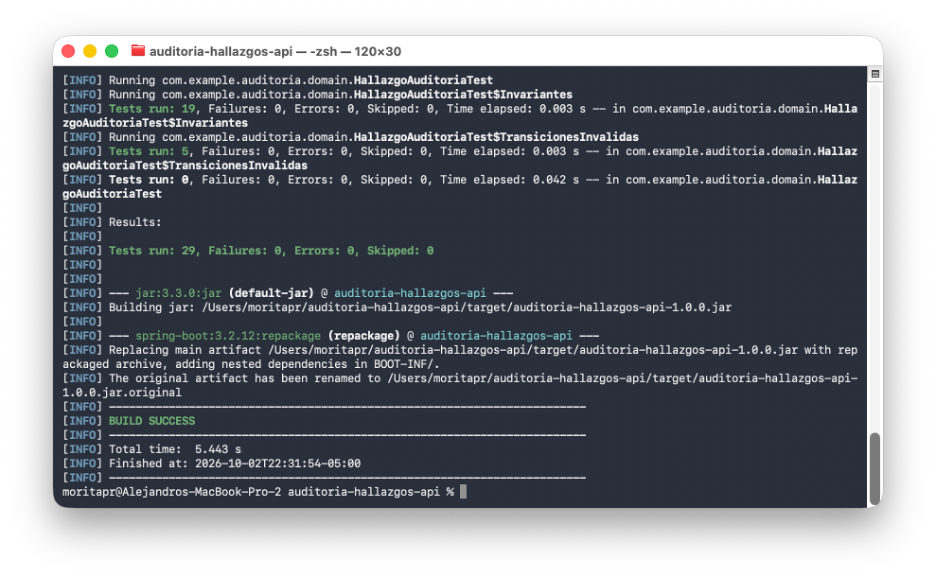
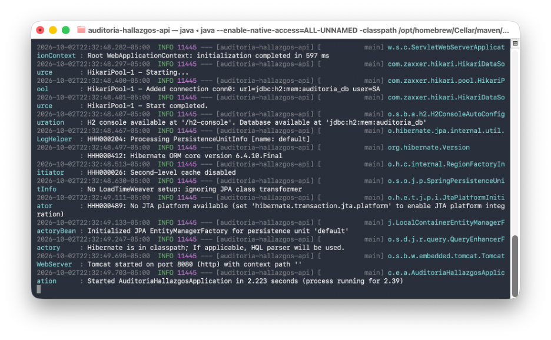
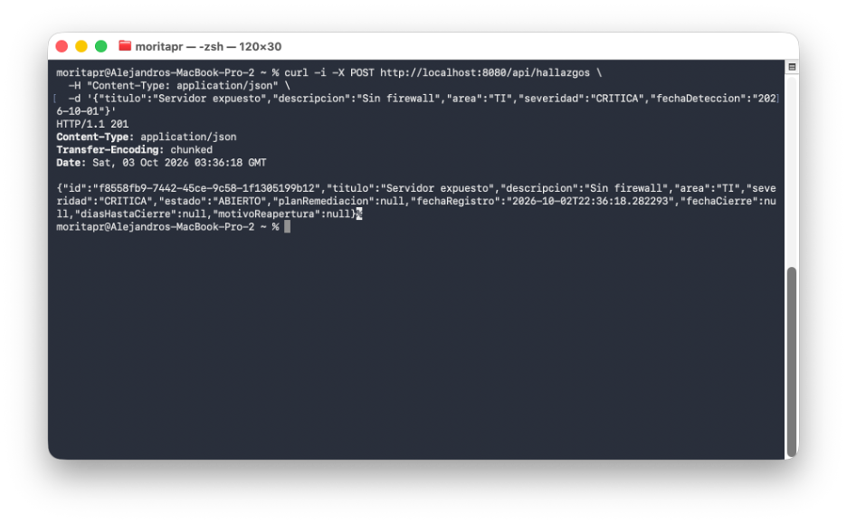
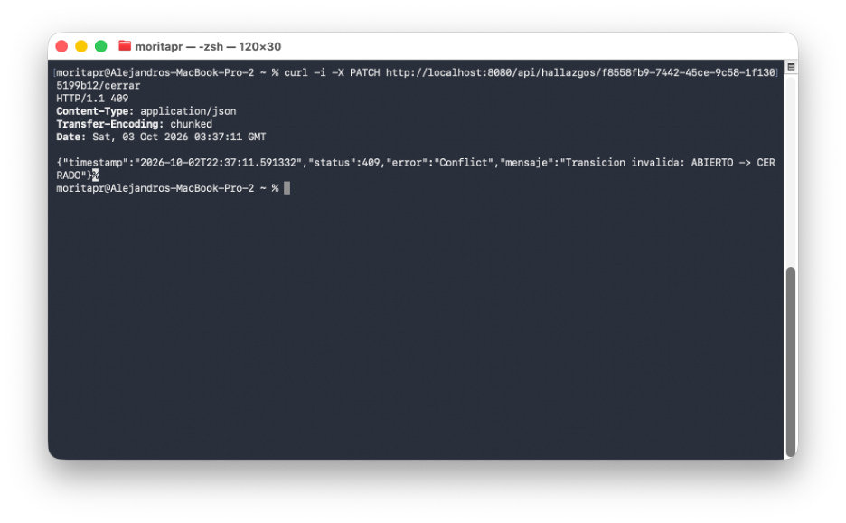
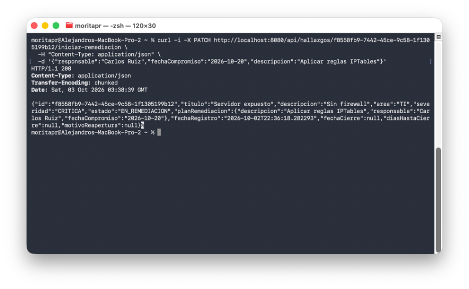
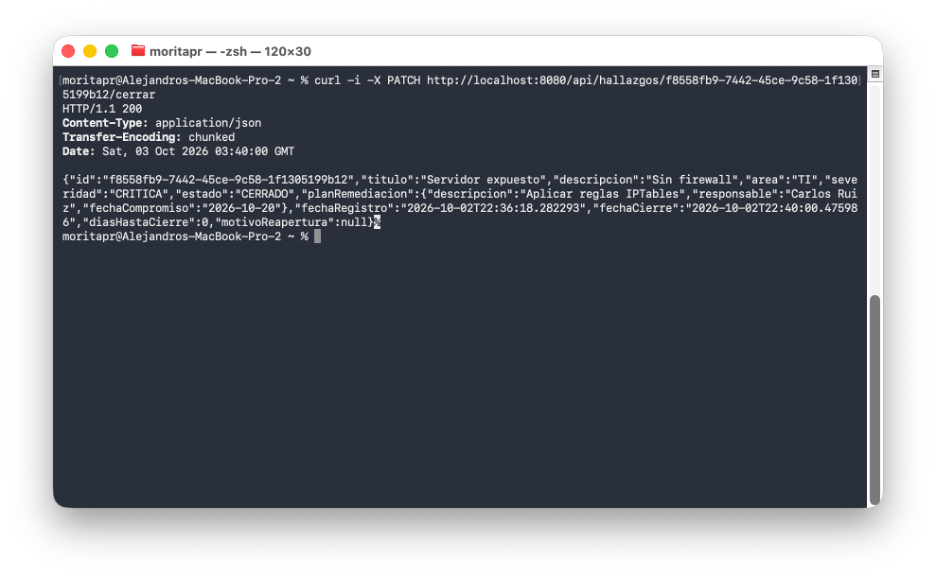
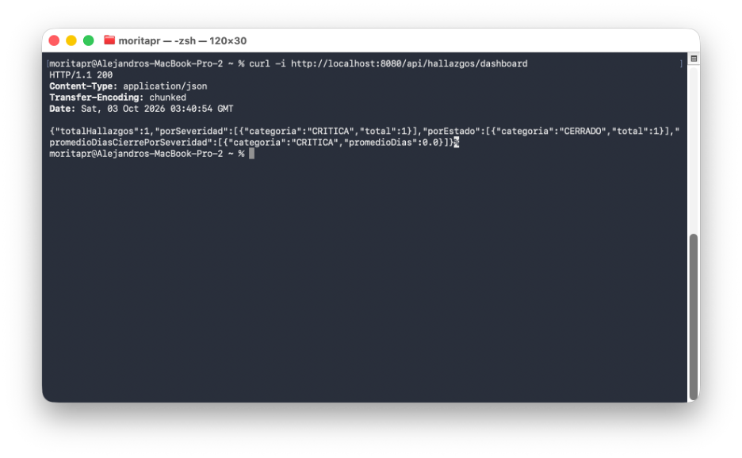
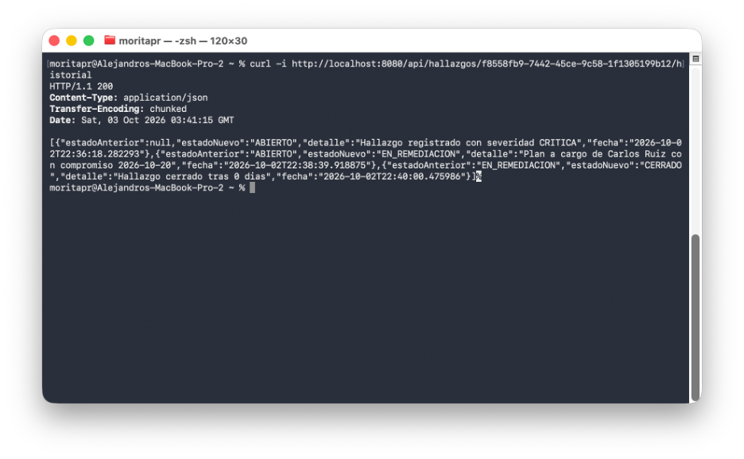

# auditoria-hallazgos-api

**Unidad 8 — Patrones Arquitectónicos II: Clean Architecture y Análisis Costo-Beneficio de CQRS en Spring Boot**

Sistema de Seguimiento de Hallazgos de Auditoría Interna. Cada hallazgo recorre una máquina de estados
(`ABIERTO → EN_REMEDIACION → CERRADO → REABIERTO → EN_REMEDIACION …`), deja una bitácora de auditoría
que no se puede alterar y alimenta un dashboard de indicadores.

| Tecnología | Versión |
|---|---|
| Java | 17 |
| Spring Boot | 3.2.12 (Web, Data JPA, Validation) |
| Base de datos | H2 en memoria |
| Build | Maven |
| Pruebas | JUnit 5 + MockMvc |

---

## 1. Clean Architecture: los cuatro círculos

```
          ┌──────────────────────────────────────────────────────────┐
          │ 4. Frameworks & Drivers   config/  (Spring, H2, Tomcat)  │
          │   ┌──────────────────────────────────────────────────┐   │
          │   │ 3. Interface Adapters   adapter/in, adapter/out  │   │
          │   │   ┌──────────────────────────────────────────┐   │   │
          │   │   │ 2. Use Cases   usecase/  (Java puro)     │   │   │
          │   │   │   ┌──────────────────────────────────┐   │   │   │
          │   │   │   │ 1. Entities  domain/ (Java puro) │   │   │   │
          │   │   │   └──────────────────────────────────┘   │   │   │
          │   │   └──────────────────────────────────────────┘   │   │
          │   └──────────────────────────────────────────────────┘   │
          └──────────────────────────────────────────────────────────┘
                       Las dependencias apuntan solo hacia adentro
```

**Regla de dependencia:** `domain` no importa nada del proyecto ni de frameworks; `usecase` solo importa
`domain`; `adapter` implementa los puertos de `usecase`; `config` ensambla todo. La regla se verifica
automáticamente en `ArquitecturaTest`, que falla si `domain/` o `usecase/` importan Spring, Jakarta,
Hibernate, `adapter` o `config`.

### Árbol de paquetes

```
src/main/java/com/example/auditoria/
├── AuditoriaHallazgosApplication.java
│
├── domain/                                   ── Círculo 1: Entities (0 dependencias)
│   ├── entity/
│   │   └── HallazgoAuditoria.java            Aggregate Root: máquina de estados + invariantes
│   └── valueobject/
│       ├── HallazgoId.java                   record UUID
│       ├── Severidad.java                    enum simple
│       ├── EstadoHallazgo.java               enum con comportamiento (puedeTransicionarA)
│       ├── PlanRemediacion.java              record inmutable embebido en el agregado
│       └── TransicionInvalidaException.java
│
├── usecase/                                  ── Círculo 2: Use Cases (0 dependencias de Spring)
│   ├── RegistrarHallazgoUseCase.java         ┐
│   ├── IniciarRemediacionUseCase.java        │
│   ├── CerrarHallazgoUseCase.java            │ lado comando
│   ├── ReabrirHallazgoUseCase.java           ┘
│   ├── ConsultarHallazgoUseCase.java         ┐
│   ├── ObtenerDashboardAuditoriaUseCase.java │ lado lectura
│   ├── ConsultarHistorialUseCase.java        ┘
│   ├── HallazgoNoEncontradoException.java
│   ├── impl/                                 *Service: implementación de cada caso de uso
│   └── port/
│       ├── HallazgoRepositoryPort.java       persistencia + consultas agregadas
│       ├── HistorialAuditoriaPort.java       bitácora (solo agregar y leer)
│       ├── UnidadDeTrabajoPort.java          atomicidad sin acoplarse a @Transactional
│       ├── DashboardAuditoriaView.java       ┐
│       ├── CambioEstadoView.java             │ vistas de lectura
│       ├── ConteoCategoria.java              │
│       └── PromedioCategoria.java            ┘
│
├── adapter/                                  ── Círculo 3: Interface Adapters
│   ├── in/web/
│   │   ├── HallazgoController.java           @RestController /api/hallazgos
│   │   ├── RegistrarHallazgoRequest.java
│   │   ├── IniciarRemediacionRequest.java
│   │   ├── ReabrirRequest.java
│   │   ├── HallazgoResponse.java
│   │   └── GlobalExceptionHandler.java       @RestControllerAdvice
│   └── out/persistence/
│       ├── HallazgoJpaEntity.java
│       ├── HallazgoJpaRepository.java        JPQL con GROUP BY y AVG
│       ├── HallazgoRepositoryAdapter.java
│       ├── HistorialCambioEstadoJpaEntity.java   bitácora append-only (@Immutable)
│       ├── HistorialJpaRepository.java       extiende Repository: sin delete/update
│       ├── HistorialAuditoriaAdapter.java
│       └── TransaccionSpringAdapter.java     implementa UnidadDeTrabajoPort con TransactionTemplate
│
└── config/                                   ── Círculo 4: Frameworks & Drivers
    └── AuditoriaConfiguration.java           @Configuration: registra los casos de uso como @Bean
```

Los `*Service` del círculo 2 **no llevan `@Service`**: son POJOs que `AuditoriaConfiguration` instancia y
registra como beans. Si mañana se cambia Spring por otro framework, el círculo 2 no se toca.

---

## 2. Máquina de estados y reglas de negocio

```
ABIERTO ──► EN_REMEDIACION ──► CERRADO ──► REABIERTO
                  ▲                            │
                  └────────────────────────────┘
```

| Regla | Dónde vive | HTTP si se viola |
|---|---|---|
| Todo hallazgo nace `ABIERTO` | `HallazgoAuditoria.registrar` | — |
| Solo transiciones permitidas por la tabla | `EstadoHallazgo.puedeTransicionarA` | 409 |
| No se cierra sin plan de remediación | `HallazgoAuditoria.cerrar` | 409 |
| El compromiso del plan no puede estar en el pasado | `HallazgoAuditoria.iniciarRemediacion` | 400 |
| Un hallazgo `CRITICA` se remedia en máximo 30 días | `HallazgoAuditoria.iniciarRemediacion` | 400 |
| Reabrir exige motivo | `HallazgoAuditoria.reabrir` | 400 |
| La bitácora no se modifica ni se borra | `HistorialCambioEstadoJpaEntity` / `HistorialAuditoriaPort` | — |

---

## 3. Puntos de decisión de diseño

### 3.1 Enum simple (`Severidad`) vs. Enum con comportamiento (`EstadoHallazgo`)

| | `Severidad` — enum simple | `EstadoHallazgo` — enum con comportamiento |
|---|---|---|
| Qué representa | Una clasificación | Un estado de un ciclo de vida |
| ¿Tiene reglas propias? | No. Solo agrupa y filtra | Sí. Sabe a qué estados puede pasar |
| Dónde viven las reglas que lo usan | En el agregado (p. ej. plazo de 30 días para `CRITICA`) | En el propio enum (`puedeTransicionarA`, `validarTransicionA`) |
| Por qué | La regla del plazo involucra al plan y a la fecha actual, que son datos del agregado; meterla en el enum lo acoplaría a conceptos que no le pertenecen | La tabla de transiciones depende **solo** del par (origen, destino): es conocimiento intrínseco del estado. Ponerla aquí evita `if/switch` repetidos en servicios y la hace probable en una tabla paramétrica |

Criterio: **el comportamiento va donde están los datos que necesita.** Si una regla depende únicamente
del valor del enum, va en el enum. Si necesita más contexto, va en el agregado.

### 3.2 `PlanRemediacion` embebido en el agregado

- Es un **Value Object** (`record` inmutable, validado en el constructor compacto): no tiene identidad ni
  ciclo de vida propio. Fuera de un hallazgo no significa nada.
- Vive **dentro** del límite de consistencia de `HallazgoAuditoria`: la invariante "no se cierra sin plan"
  se verifica en una sola transacción sin consultar otra tabla ni otro agregado.
- Cambiar el plan es **reemplazarlo** completo (al reabrir y volver a remediar se asigna uno nuevo), no
  editar campos sueltos. El plan anterior queda registrado en la bitácora.
- En persistencia se **aplana** en columnas de la tabla `hallazgos` (`plan_descripcion`,
  `plan_responsable`, `plan_fecha_compromiso`). Una tabla `planes` con FK sería una entidad sin
  justificación de dominio y un JOIN en cada lectura.

### 3.3 Unidad de trabajo como puerto

Guardar el agregado y escribir la bitácora debe ser atómico (no puede existir un cambio de estado sin
registro de auditoría). `@Transactional` acoplaría el círculo 2 a Spring, así que el caso de uso depende
de `UnidadDeTrabajoPort` y el adaptador lo implementa con `TransactionTemplate`.

---

## 4. Análisis Costo-Beneficio de CQRS / Event Sourcing

El dominio tiene dos necesidades que suelen usarse para justificar CQRS y Event Sourcing:

1. **Un dashboard** de conteos y promedios (lectura con forma distinta a la escritura).
2. **Una bitácora inalterable** de cada cambio de estado (requisito típico de auditoría).

Se evaluaron tres opciones:

| Criterio | A. CRUD plano | **B. Extensión Liviana (elegida)** | C. CQRS + Event Sourcing completos |
|---|---|---|---|
| Modelo de escritura | Entidad JPA anémica | Agregado rico + tabla de estado actual | Event store; el estado se reconstruye reproduciendo eventos |
| Modelo de lectura | Mismas entidades, agregación en Java | Proyecciones **JPQL `GROUP BY` / `AVG`** sobre la misma tabla | Read models separados, actualizados por proyectores asíncronos |
| Bitácora de auditoría | No existe | Tabla **append-only** escrita en la misma transacción | Los eventos *son* la bitácora |
| Consistencia de lectura | Inmediata | **Inmediata** | Eventual (hay que manejar el desfase en la UI) |
| Infraestructura extra | Ninguna | **Ninguna** | Event store, bus/broker, proyectores, reintentos, replays |
| Versionado de esquema | Migración SQL | Migración SQL | Upcasters para cada versión de evento histórico |
| Clases adicionales | 0 | ~6 (2 entidades, 2 repos, 1 adaptador, vistas) | Decenas (eventos, handlers, proyectores, snapshots) |
| Curva de aprendizaje y depuración | Baja | Baja | Alta |
| Cumple dashboard | Sí, pero carga todo a memoria | **Sí, lo resuelve la BD** | Sí |
| Cumple auditoría inalterable | **No** | **Sí** | Sí |
| Reconstruir el estado en una fecha pasada ("time travel") | No | Parcial (leyendo la bitácora) | Sí, nativo |

### Por qué la Extensión Liviana

- **Separa comandos y consultas a nivel de caso de uso** (`RegistrarHallazgo`, `Cerrar`… frente a
  `ObtenerDashboard`, `ConsultarHistorial`) sin separar bases de datos. El lado de lectura no rehidrata
  agregados: el dashboard ejecuta tres consultas agregadas y la BD hace el trabajo.
  ```java
  @Query("SELECT h.severidad, AVG(h.diasCierre) FROM HallazgoJpaEntity h "
       + "WHERE h.estado = :estado GROUP BY h.severidad ORDER BY h.severidad")
  ```
- **La bitácora append-only da el 90 % del valor de Event Sourcing para auditoría** (quién pasó de qué
  estado a cuál, cuándo y por qué) con el 10 % del costo: es una tabla más, escrita en la misma
  transacción, con consistencia inmediata. Se protege en tres capas: el puerto solo expone
  `registrarCambio`/`obtenerHistorial`, el repositorio extiende `Repository` (sin `delete`), y la entidad
  es `@Immutable` con `@PreUpdate`/`@PreRemove` que lanzan excepción.
- **El volumen no lo exige.** Un área de auditoría interna registra cientos o pocos miles de hallazgos
  al año. `GROUP BY` sobre esa cantidad tarda milisegundos; no hay un problema de escalabilidad de
  lectura que justifique read models separados.
- **La consistencia eventual sería un costo real para el usuario:** un auditor que cierra un hallazgo y
  ve el dashboard sin cambios pensaría que la operación falló.
- `dias_cierre` se **desnormaliza** al cerrar para que `AVG` sea JPQL portable (la diferencia de fechas
  en SQL depende del motor). Es la única concesión al modelo de lectura.

### Cuándo sí migrar a CQRS / Event Sourcing completos

| Señal | Respuesta |
|---|---|
| El dashboard se vuelve lento con millones de filas o muchos usuarios concurrentes | Read model separado (vista materializada o tabla de proyección) — CQRS sin ES |
| Regulación exige reconstruir el estado exacto del sistema en cualquier fecha pasada | Event Sourcing |
| Otros sistemas (riesgos, cumplimiento) deben reaccionar a cada cambio de estado | Publicar eventos de dominio (outbox) |
| Lecturas y escrituras necesitan escalar de forma independiente | CQRS con almacenes separados |

Gracias a Clean Architecture, esa migración solo afecta al círculo 3: `HallazgoRepositoryPort` e
`HistorialAuditoriaPort` se reimplementarían sobre un event store y los casos de uso y el dominio no
cambiarían.

---

## 5. Endpoints

| Método | Ruta | Éxito | Errores |
|---|---|---|---|
| `POST` | `/api/hallazgos` | 201 — crea en `ABIERTO` | 400 |
| `PATCH` | `/api/hallazgos/{id}/iniciar-remediacion` | 200 — pasa a `EN_REMEDIACION` con plan | 400, 404, 409 |
| `PATCH` | `/api/hallazgos/{id}/cerrar` | 200 — pasa a `CERRADO` con fecha | 404, 409 |
| `PATCH` | `/api/hallazgos/{id}/reabrir` | 200 — pasa a `REABIERTO` con motivo | 400, 404, 409 |
| `GET` | `/api/hallazgos/{id}` | 200 — detalle del hallazgo | 404 |
| `GET` | `/api/hallazgos/dashboard` | 200 — conteos por severidad y estado, promedio de días de cierre | — |
| `GET` | `/api/hallazgos/{id}/historial` | 200 — bitácora cronológica | 404 |

---

## 6. Compilación, pruebas y ejecución

```bash
cd ~/auditoria-hallazgos-api
mvn clean package                 # compila y ejecuta las 29 pruebas
java -jar target/auditoria-hallazgos-api-1.0.0.jar
# o bien: mvn spring-boot:run
```

Pruebas incluidas:

| Clase | Tipo | Qué cubre |
|---|---|---|
| `domain/HallazgoAuditoriaTest` | Unitaria, sin Spring | Ciclo completo, transiciones inválidas, invariantes y tabla paramétrica de las 12 transiciones |
| `ArquitecturaTest` | Estructural | Regla de dependencia de los círculos 1 y 2 |
| `adapter/HallazgoApiIntegrationTest` | Integración (MockMvc + H2) | Flujo HTTP completo, historial, dashboard y códigos de error |

### Consola H2

- URL: <http://localhost:8080/h2-console>
- JDBC URL: `jdbc:h2:mem:auditoria_db` · Usuario: `sa` · Contraseña: *(vacía)*
- Tablas: `HALLAZGOS`, `HISTORIAL_CAMBIOS_ESTADO`

---

## 7. Pruebas con cURL

```bash
# 1. Registrar hallazgo (201, estado ABIERTO)
curl -i -X POST http://localhost:8080/api/hallazgos \
  -H "Content-Type: application/json" \
  -d '{"titulo":"Accesos sin revisar","descripcion":"Usuarios inactivos con acceso al ERP","area":"Tecnologia","severidad":"CRITICA"}'

# Guardar el id devuelto
ID=<id-devuelto>

# 2. Transicion invalida: cerrar sin remediar (409)
curl -i -X PATCH http://localhost:8080/api/hallazgos/$ID/cerrar

# 3. Iniciar remediacion con plan (200, EN_REMEDIACION)
#    Para CRITICA la fecha de compromiso debe estar dentro de los proximos 30 dias
curl -i -X PATCH http://localhost:8080/api/hallazgos/$ID/iniciar-remediacion \
  -H "Content-Type: application/json" \
  -d '{"descripcion":"Depurar usuarios inactivos","responsable":"Jefe de TI","fechaCompromiso":"2026-10-20"}'

# 4. Cerrar (200, CERRADO con fechaCierre y diasHastaCierre)
curl -i -X PATCH http://localhost:8080/api/hallazgos/$ID/cerrar

# 5. Reabrir con motivo (200, REABIERTO)
curl -i -X PATCH http://localhost:8080/api/hallazgos/$ID/reabrir \
  -H "Content-Type: application/json" \
  -d '{"motivo":"La verificacion encontro usuarios activos sin depurar"}'

# 6. Dashboard (200)
curl -s http://localhost:8080/api/hallazgos/dashboard

# 7. Historial de auditoria (200)
curl -s http://localhost:8080/api/hallazgos/$ID/historial
```

Respuesta de ejemplo del dashboard:

```json
{
  "totalHallazgos": 1,
  "porSeveridad": [{ "categoria": "CRITICA", "total": 1 }],
  "porEstado": [{ "categoria": "CERRADO", "total": 1 }],
  "promedioDiasCierrePorSeveridad": [{ "categoria": "CRITICA", "promedioDias": 0.0 }]
}
```

Respuesta de ejemplo del historial:

```json
[
  { "estadoAnterior": null,             "estadoNuevo": "ABIERTO",        "detalle": "Hallazgo registrado con severidad CRITICA",          "fecha": "2026-10-02T22:00:22.006934" },
  { "estadoAnterior": "ABIERTO",        "estadoNuevo": "EN_REMEDIACION", "detalle": "Plan a cargo de Jefe de TI con compromiso 2026-10-17", "fecha": "2026-10-02T22:00:22.092538" },
  { "estadoAnterior": "EN_REMEDIACION", "estadoNuevo": "CERRADO",        "detalle": "Hallazgo cerrado tras 0 dias",                        "fecha": "2026-10-02T22:00:22.110999" }
]
```

---

## 8. Evidencias de auditoría

| # | Evidencia | Captura |
|---|---|---|
| 1 | `mvn clean package` — BUILD SUCCESS con 29 pruebas |  |
| 2 | Arranque de la aplicación Spring Boot |  |
| 3 | `POST /api/hallazgos` — 201, estado `ABIERTO` |  |
| 4 | Cerrar un hallazgo `ABIERTO` — 409 transición inválida |  |
| 5 | `PATCH /iniciar-remediacion` — 200, `EN_REMEDIACION` con plan |  |
| 6 | `PATCH /cerrar` — 200, `CERRADO` con fecha de cierre |  |
| 7 | `GET /api/hallazgos/dashboard` — conteos y promedios |  |
| 8 | `GET /api/hallazgos/{id}/historial` — bitácora cronológica |  |
